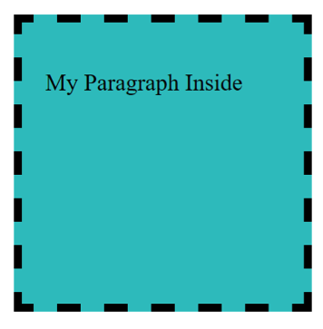

# Challenge: Dotted Square
 
## Goal of the challenge

Show this in the browser



## Step by Step

**1-**  Create a HTML page by typing out the following: 
    
```html
<!DOCTYPE html>
<html lang="en">
    <head>
        <meta charset="UTF-8">
        <title>Box Model</title>
        <style type="text/css">
            /*CSS here*/
        </style>
    </head>
    <body>
        <div class=""></div>
    </body>
</html>
```

**2-** Save your file as `box.html`

**3-** Inside the `<head>` and between the `<style>` tags create a CSS class, named `.box`, with the following CSS rules. 
  
```css
.box {
  width:300px;   
  height: 300px;
  background-color:#31c5c7;
  margin: 50px;
  border: 10px dashed #000;
}
```

**4-**  In the html give the `<div>` the class name of box

**5-**  Open the HTML page in your browser

**6-**  Modify all the values of the code and see how it affects the expected output.
 
**7-**  Place a paragraph `<p>some text</p>` inside the div tags.

**8-**  Add 30px of padding to the `.box` class.

