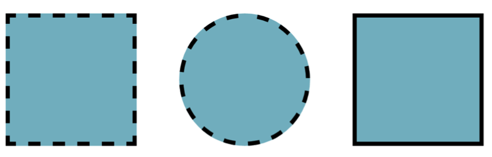

# Challenge: Dotted Shapes
 
## Goal of the challenge

Show this shapes in the browser using CSS

## Step by Step

**1-**  Remove the paragraph tag within the `
`  

**2-**  Add 2 more  boxes to your html in the form of `
` tags  

**3-**  Assign each `
` to the box class   

**4-**  Create an id for each box (box1, box2, box3)  

**5-**  Add a border radius of _200px_ to box2 and a _solid_ border style to box3.

## Extra Challenge

Obtain the following shapes w/ previous HTML

