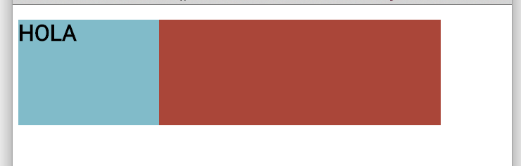
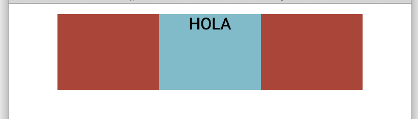
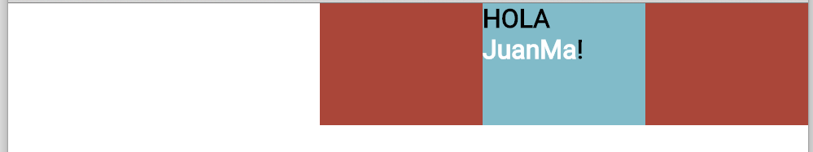

# Challenge: Centering elements

1- Open `index.html` (located in this folder)

_You see this..._

2- Center the element with `id="container"` on the page   
3- Center the box within the container   
4- Center the `<h1>` within the box

_We have to get this..._

## Extra

- Add a [_normalize_](https://cdn.jsdelivr.net/normalize/3.0.3/normalize.css) css file as the first link after the `<title>`
- Align `id="container` to the right side of the page.
- Add your name inside of the `<h1>` and style it white using ``
- Align the contents inside the _box_ to the left of the box.

