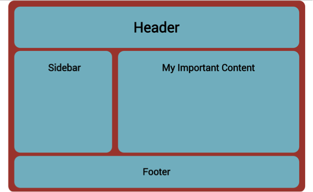
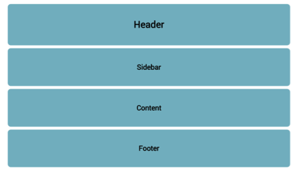
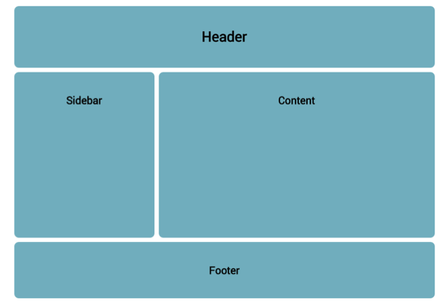
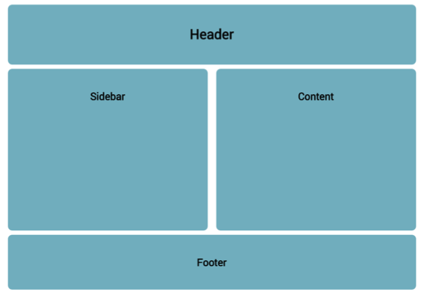

# Challenge: Layout

Let's put the lessons you have learned into practice by demonstrating how you would make the following layout


 
### Step 1: _container_

First let's make a div with id container to place our elements (eventually becoming Header, Sidebar, etc). 

```html
<div id="container"></div>
```

Below is some CSS to start with. Place the CSS in between the <style> </style> tags in the head of your page.

Our container has a `width` of _960px_ and a `height` of _600px_ and `background-color: #AA4639` 

```css
#container {
    margin-right: auto; /*Auto margins used for centering elements*/
    margin-left: auto; 
    width: 960px;
    height: 600px; /* temporal value */
    background-color: #AA4639;7.   
}
```


### Step 2: _boxes_

Let's add some elements into our container starting with 3 divs in the form of boxes, for this we will make a box class: 
 
```html
<div id="container">
    <div class="box"></div>
    <div class="box"></div>
    <div class="box"></div>
</div>
```


```css
.box {
    width: 220px;
    height: 150px;
    background-color: #81BBC9;
    margin: 10px;
}
```

Notice how these block elements don’t sit side by side. They are stacked as block-level elements will do.

### Step 3: making _container_ prettier

Let’s make the container look a little better with some padding and rounded borders. 

```css
#container {
    ...
    padding: 10px;
    border-radius: 10px;
    ...
}
```

### Step 4: removing _container_'s height

As the container has elements inside we can now remove (delete) the height property. 
 
 

Do you see what happens to the container when you remove the height property? 
Looks a little better, don’t you think? 
You should now have code that looks something like this:

```html
<!doctype html>
<html lang= "en">
    <head>
        <meta charset="UTF-8">
        <title>Layout Challenge</title>
        <style type="text/css">

        #container {
            margin-right: auto; 
            margin-left: auto;
            width: 960px;
            background-color: #AA4639;
            padding: 10px;
            border-radius: 10px;
        }

        .box {
            width: 220px;
            height: 150px;
            background-color: #81BBC9;
            margin: 10px;
            border-radius: 10px;
        }

        </style>
    </head>
    <body>
        <div id="container">
            <div class="box"></div>
            <div class="box"></div>
            <div class="box"></div>
        </div>
    </body>
</html>
```

### Step 5: align boxes in a row

The next step is to align the blue boxes in a row rather than a column.

To put the boxes side by side we will change the display to `inline-block`. Go check the notes in this lesson if you are unsure how to do that? 
 
Looks great but we are left with a box sized gap to the right!!!

### Step 6: adding a fourth box (`inline-block`'s issue)

We will add a fourth box to the container. What are the calculations involved? 
Container width is _960px_, boxes are _220px_ each. Then we have the margins (right & left) of each box. If we do the maths they should fit shouldn’t they?
 
Boxes are not fitting!!

But the boxes do not fit. We will need to resolve this issue in a rather unusual way. Let’s look at the following important note.

> _Important Note:_

> When using `inline-block` to layout a page you will often find a frustrating little white space visible between two elements. This extra space is the reason our boxes above don’t fit. But do not worry, this is a normal function of `inline-block` elements and there are a number of ways to remove this annoying little space. 
> If we give the container element a font-size of “0”, the space will disappear! Hoooray!! But now any text placed in the boxes will also have a “0” font-size. That’s ok, because we can give the box class  a font-size of 16px(or whatever you wish) and your boxes will fit and look lovely...Congratulations on your first CSS hack! 

More info: [Fighting the Space Between Inline Block Elements](https://css-tricks.com/fighting-the-space-between-inline-block-elements/)

```css
#container {
    ...
    font-size:0;
    ...
}
```

### Step 7: _header_, _sidebar_, _content_ & _footer_ boxes

- Make `width:100%` in boxes
- Remove `background-color` in container
- Add headings & center them (`text-align:center`).
- Add some padding to the boxes (top and bottom).



### Step 8: Final layout

- Create id’s for the Sidebar and Content.
- Make them inline-block and give them a `height` of _320px_.
- Remove all margins from `.box` class for the moment
- _Maths time!_ - perform the width calculation to fit them inside the 960px container. 
- Remember the margins (left and right). Because we are using inline-block for styling we need the `container` element to have font-size=0.
- The `.box` elements should have a `font-size` greater than 0

- Adjust the _sidebar_ & _content_ boxes width to look like this



### Extra Challenge

Create the following layouts using percentage (%) widths rather than pixels (px)

**Layout 1**  


**Layout 2**  


